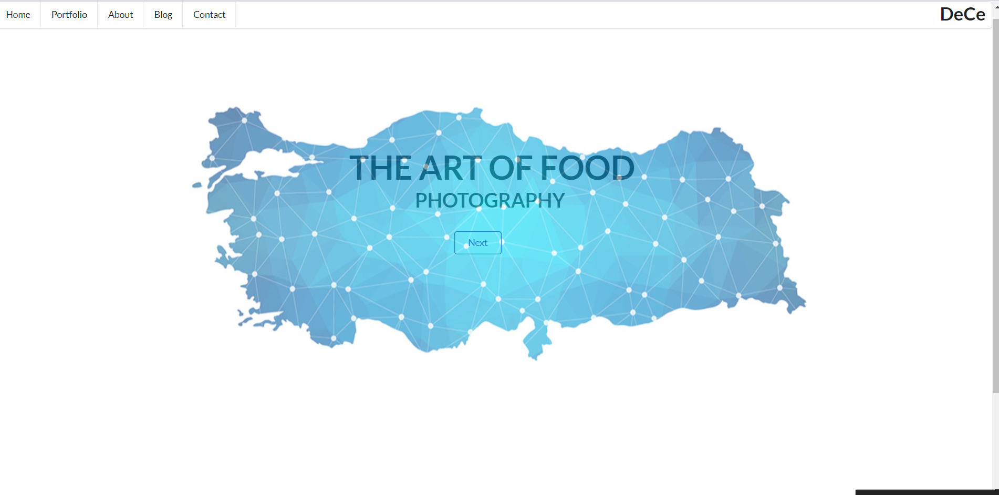
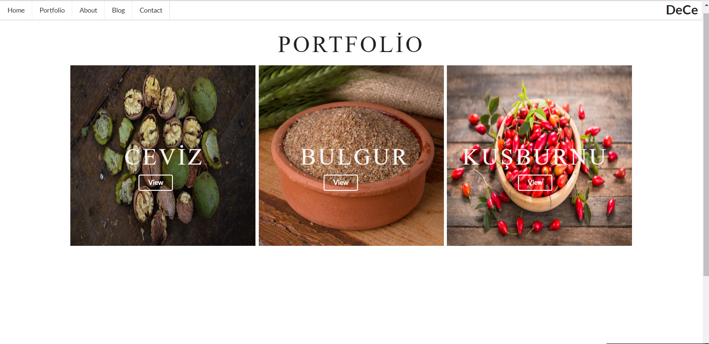
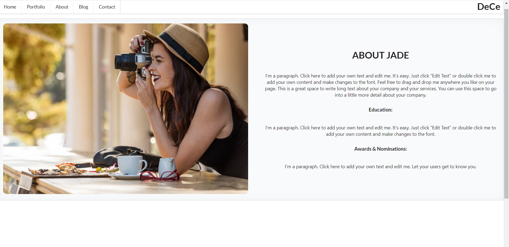
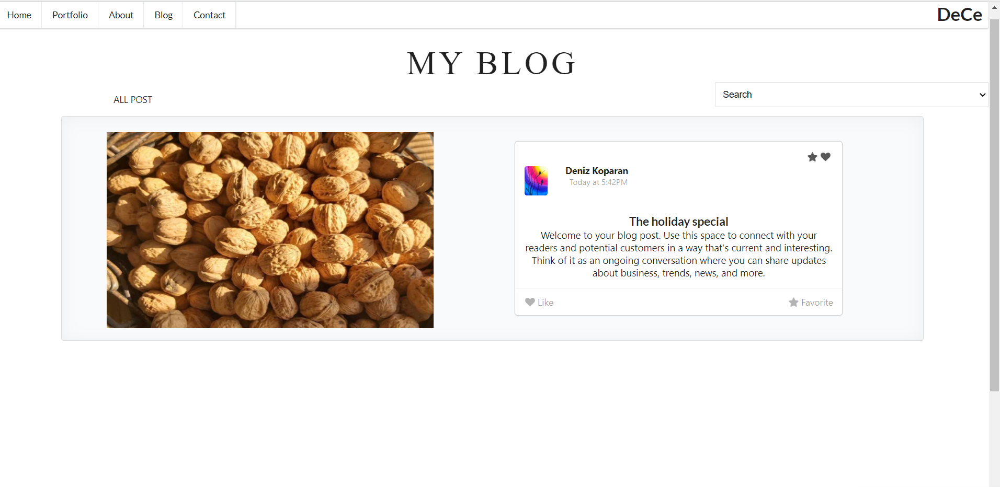
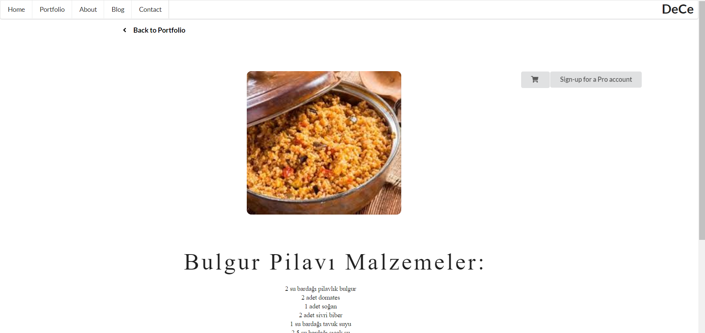

*I made this website with reactjs. I created 5 pages in this project. First I built a homepage. 
I used semantic-ui's library for menu. Then I created in order blog page, portfolio page, about page and contact page.
There are various products in portfolio. If you will choose any product, you can see recipe of product that you chose.
if you want to learn something about the website , you can get information from about page. 
You can share your comments about the page with customers from the blog page. If you want to send message to us, 
you can send message from contact page. We wish safe shopping ......*

**INSTALLATION** 

npm install react-scripts 
npm install react-router-dom

**OVERVİEW**

